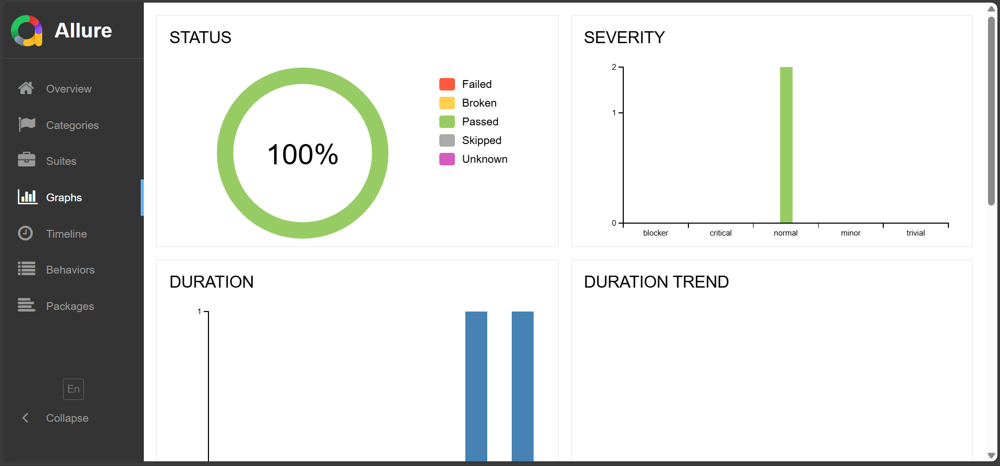

## DemoQA Book Store UI Assignment

This project automates an end-to-end user flow on the DemoQA **Book Store Application** using Playwright.  
The test logs in with a demo user, searches for a specific book, verifies the result, stores the book details in a text file, and then logs out.

### Flow covered by the test

- **Open DemoQA**:  
  - Navigate to `https://demoqa.com/`.
- **Go to Book Store Application**:  
  - Click on the "Book Store Application" card.
- **Login**:  
  - Open the login form.  
  - Log in with the test credentials `Akshat / Akshat@123`.
- **Post-login checks**:  
  - Verify that the logged-in username is visible.  
  - Verify that a logout button is present.
- **Navigate to Book Store**:  
  - From the profile page, click **Go To Book Store** to open the list of books.
- **Search for a book**:  
  - Search for `"Learning JavaScript Design Patterns"` using the search box.
- **Validate book details**:  
  - Find the matching row in the table.  
  - Read its **title**, **author**, and **publisher**.  
  - Assert that the title contains the expected book name.
- **Persist book details**:  
  - Save the book information into `bookDetails.txt` in the project root.
- **Logout**:  
  - Click the logout button to end the session.

### What is in this project

- **`tests/bookstore.spec.js`**  
  - Main Playwright test file.  
  - Wires together the login and book store page objects, performs the full flow, and writes out `bookDetails.txt`.

- **`pages/loginPage.js`**  
  - Page Object Model for the DemoQA Book Store login/profile pages.  
  - Wraps login-related locators and actions (open login, submit credentials, go to book store, logout checks).

- **`pages/bookstorePage.js`**  
  - Page Object Model for the Book Store listing and search area.  
  - Knows how to type into the search field and extract details for the matching book row.

- **`utils/fileUtil.js`**  
  - Simple helper that writes the selected book’s title, author, and publisher into `bookDetails.txt`.

- **`bookDetails.txt`**  
  - Sample text file generated by a successful run for  
    `"Learning JavaScript Design Patterns"` (title, author, publisher).

- **`playwright.config.js`**  
  - Standard Playwright configuration.  
  - Uses the **HTML reporter**, runs tests in `./tests`, and keeps traces, videos, and screenshots on failure.

### How to run the tests locally

1. **Install dependencies**

   ```bash
   npm install
   ```

2. **Install Playwright browsers** (only needed once)

   ```bash
   npx playwright install
   ```

3. **Run the test suite**

   ```bash
   # run all tests from the CLI
   npx playwright test

   # or, using the npm script
   npm test
   ```

4. **View the HTML report**

   ```bash
   # open the latest Playwright HTML report
   npx playwright show-report

   # or, using the npm script
   npm run report
   ```

5. **Check the generated files**

   - After a successful run, verify:
     - `bookDetails.txt` in the project root (contains the selected book’s details).  
     - `playwright-report/index.html` for a full, interactive test report.  
     - Files in `test-results/` for traces, screenshots, and videos created by Playwright.

- **Raw test results**
  - Stored under the `test-results/` folder (automatically created by Playwright).
  - Includes:
    - **Traces** (because `trace: "on"` is set in `playwright.config.js`)
    - **Screenshots**
    - **Videos**
  - All of these are turned on to capture screenshots, videos, and traces for the report; otherwise, they are typically set to retain only on failure.
  - These artifacts can be inspected or attached as part of the assignment.
  - Traces allow step-by-step replay of failed tests in Playwright’s Trace Viewer.
## 📦 Assignment Deliverable Files

- `bookDetails.txt` – Book details captured during a successful test run.  
- `playwright-report/` – HTML report directory generated by Playwright.  
- `test-results/` – Raw Playwright artifacts (traces, screenshots, videos).  
- `allure-results/` – Raw Allure results generated during execution.  
- `allure-report/` – Generated Allure HTML report (open `allure-report/index.html`).  
- `result_snapshots/` – Static screenshots captured from:
  - Running the tests  
  - Viewing the Playwright HTML report  
  - Viewing the Allure report  

---

## 🖼 Result Snapshots

###  Successful Execution on Both Browsers


###  Detailed Report – Chromium Browser


###  Detailed Report – Firefox Browser


###  Allure Report


---

These screenshots demonstrate successful test execution and the generated HTML report pages for this assignment.
